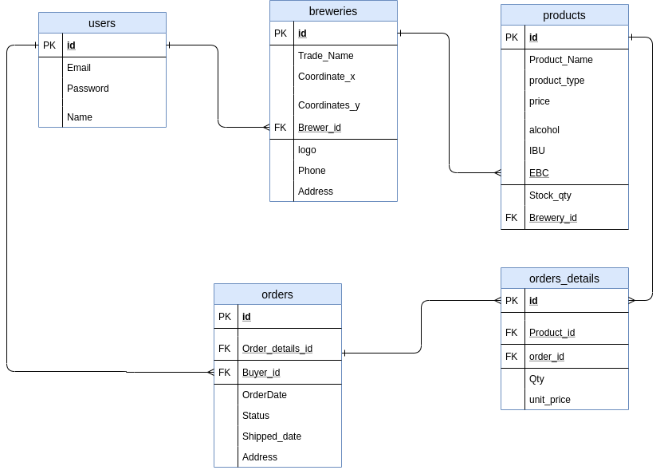

# Beerlovers

Beerlovers is a single-page aplication builded in React with some routes simulated.This application is builded to be used in mobile devices.

This repository we build t a React application that allows users to find a beer home brewery in the Montreal map (Leaflet). The user can have an acount to add, modify and delete his products. THe user can find a home made beer by type the beer and selected in a list of beer to see the beer description.
The user can buy the beer from others beers brewers. I use an API server with JWT athentification to protect the private routes. I build this project to practice React, HTML, CSS, JS,JSX, front-end skills, and Node, Express and PostgreSql back-end skills and I use Figma to the preview front end design.

# **_<u> UserStories</u>_**

**Registration:**

As a user, I can:

1. Register for the application by entering my email, password, favourite beer ( blonde,amber and black, white)
2. Upload a profile photo and add my name , telephone number and name.

**Login:**

As a registered user, I can log into the application by entering my email and password.

**My Account:**

As a logged user I can:

1.  View and modify my account information.
2.  Add, delete and modify the beers or products associate to my account.
3.  Describe my product with a product name, price, type, description, ingredients, picture.
4.  Logout of the application from my account.
5.  Buy the beers or others products.
6.  Rate the products or beers associate to others accounts.
7.  Add comments to the products or beers associate to others accounts.(stretch)
8.  Make a list of my favourites beers.(stretch)

**Logged user:**

As a logged user, I can :

1.  View the list of beer by name and type.
    1. A logged user can select a beer and:
       1. view the complete description
       2. rate beers (stretch)
       3. comment the beers (stretch)
2.  View the map of Montreal with the beers brewery. (Qc / Canada optional)
3.  Click on the beers brewery point in the map and view the list of beers associates to this point.
    1. A logged user can:
       1. View the beer brewery description
       2. Access to the beers by this beer brewery
       3. rate beers (stretch)
       4. comment the beers (stretch)
    2.
4.  Access to the section "Make your own beer" and watch the videos and links.(stretch)
5.  Access to the section beer history.(optional)

## Setup

Install dependencies with `npm install` in backend and client side, and then run them in parallel.

## Running Webpack Development Server

```sh
npm start
```

## Stacks

### Front End

- React
- Styled components
- Fontawesome
- Bootstrap
- Leaflet
- Router
- Axios

### Back End

- Express.js
- Node.js
- Jsonwebtoken

### Database

- PostgreSQL

## Final Product (iPhone X)

### Load Page


### TopNavBarExpanded


### Login


### BeerMap


### SelectedMapPoint


### Type of Beers


### Beer List By Type: Blonde


### Beer Description


### Beer Cart


### Checkout


### Favourites Beers


### ERD


