# Beerlovers

Beerlovers is a single-page aplication builded in React with some routes simulated.This application is builded to be used in mobile devices.

This repository we build t a React application that allows users to find a beer home brewery in the Montreal map (Leaflet). The user can have an acount to add, modify and delete his products. THe user can find a home made beer by type the beer and selected in a list of beer to see the beer description.
The user can buy the beer from others beers brewers. I use an API server with JWT athentification to protect the private routes. I build this project to practice React, HTML, CSS, JS,JSX, front-end skills, and Node, Express and PostgreSql back-end skills and I use Figma to the preview front end design.

## Setup

Install dependencies with `npm install`.

## Running Webpack Development Server

```sh
npm start
```

## Final Product (iPhone X)

### Load Page

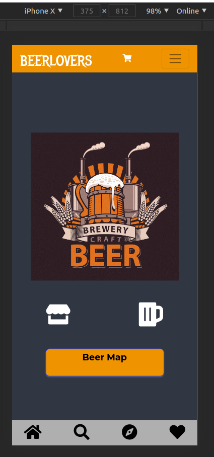

### TopNavBarExpanded

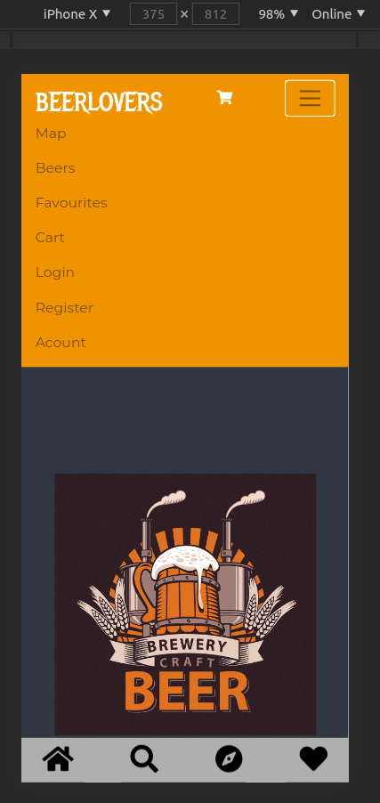

### Login

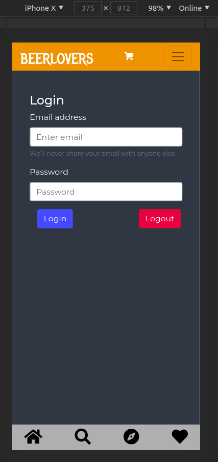

### BeerMap

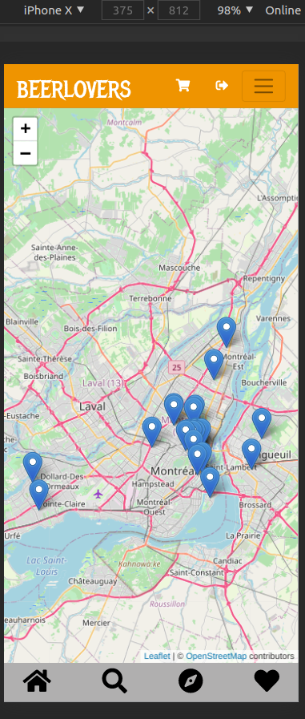

### SelectedMapPoint

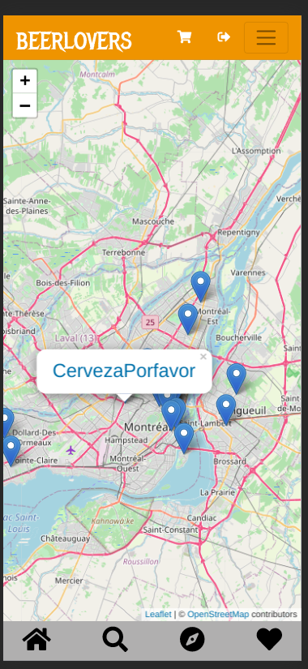

### Type of Beers

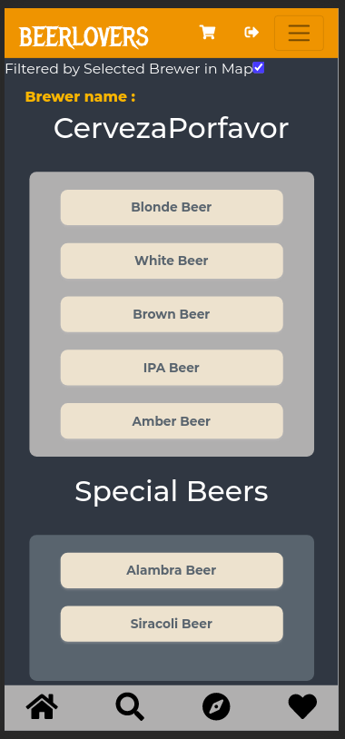

### Beer List By Type: Blonde

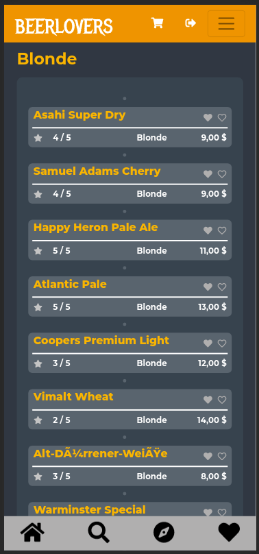

### Beer Description

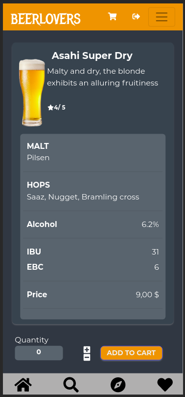

### Beer Cart

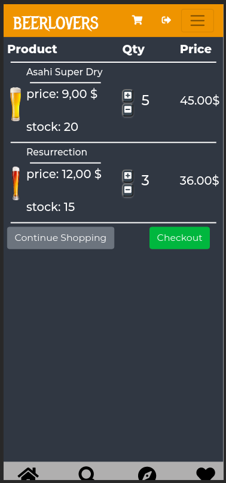

### Checkout

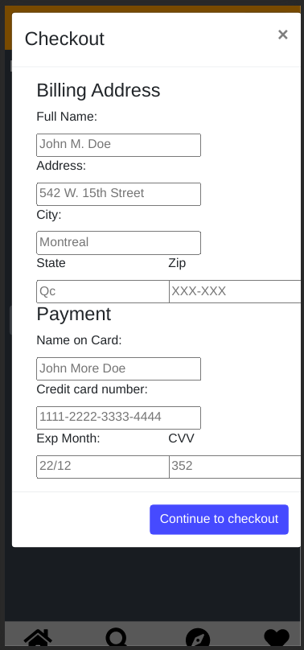

### Favourites Beers

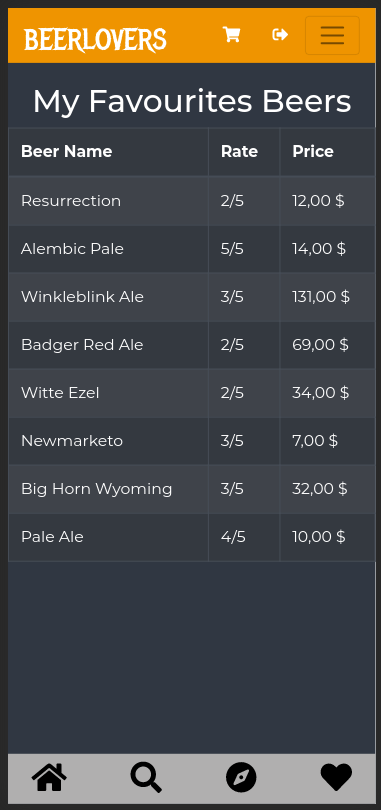
